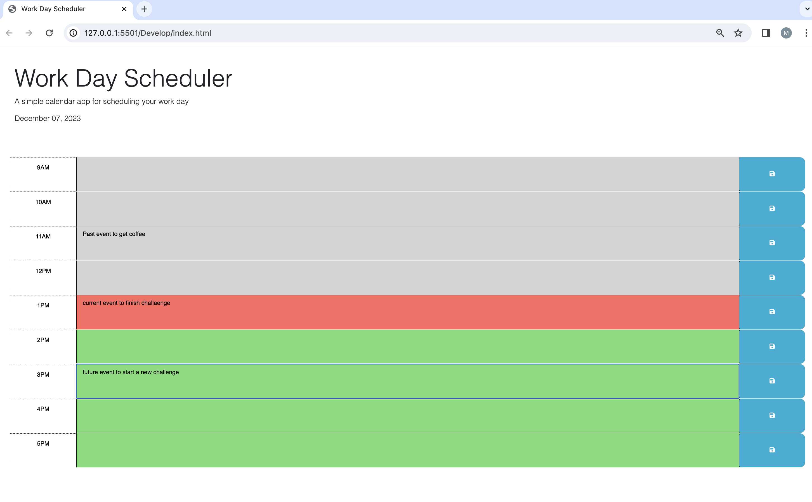

README

# Work Day Scheduler
By Maymi Sarr

## Table of contents
- [Purpose](#purpose)
- [Description](#description) 
- [Installation](#installation)
- [Link](#link)
- [Screenshot](#screenshot)

## Purpose
The purpose of this app is to help with scheduling and managing one’s (9am-5pm) work day from Monday through Friday efficiently. 

## Description
The work day scheduler app is a week day planner to help manage one’s schedule on an hourly basis while keeping in touch with the current date and time. The date is displayed at the top of the page and is updated every 24 hours. Once events are added to the calendar and saved, they are color coded to represent the past, present, and current event/hour of the day. 

## Installation

Jquery 

JSON (live server)

Day.js

## Link

## Screenshot

